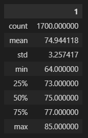
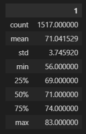

# **Surfs Up Analysis**

## **Overview**
The analysis is being done to inform the opening of a new surf business, to ensure seasonal rain and weather will not prevent a successful launch year.

## **Results**
Details

June Temperature Results

December Temperature Reults

- In total, June has more observed readings, yet both months have a large enough sample size to be reliable for analysis.
- December has only a slightly cooler mean temperature (71 degrees) compared to June (74 degrees), highlighting the stability of warm weather throughout these two months.
- The standard deviation of temperatures in December is higher (3.74) compared to June (3.25) so it can be expected that temperate weather is less reliable in December, yet on average will be a pleasant month as well for business purposes.

## **Summary**
Overall, the two months analyzed are similar to one another, showcasing the durability of a surfing business in this region. Should further analysis be desired, the following layers of analysis could be next:
- Evaluate precipitation levels from the two months to see if rain patterns will be as similar as the temperature trends between the two times of year.
- Expand analysis to look at temperature readings across each month of the year to see if the business should have a seasonal schedule.
